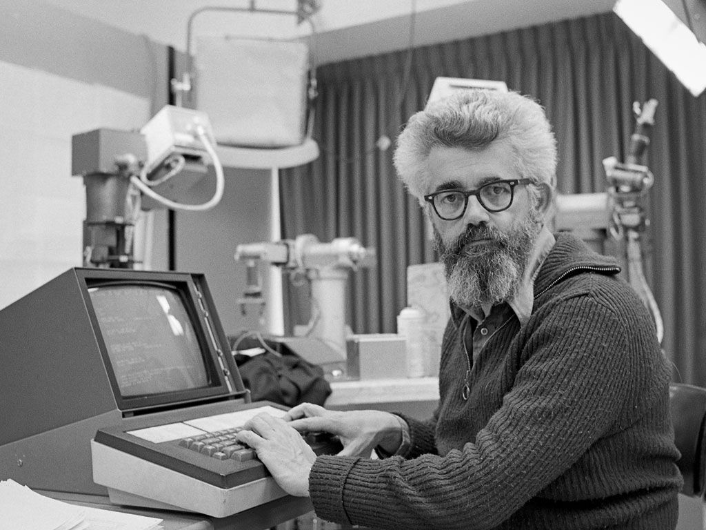
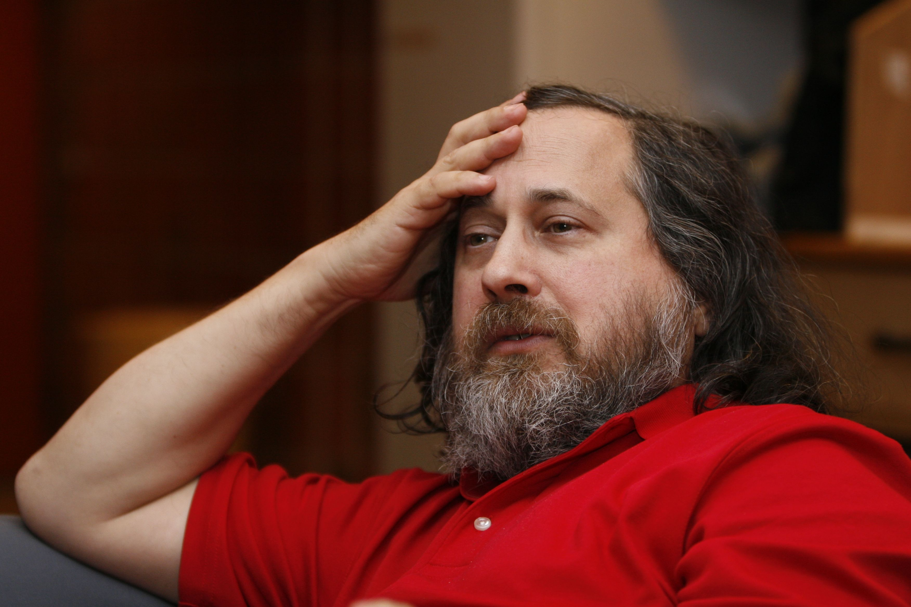
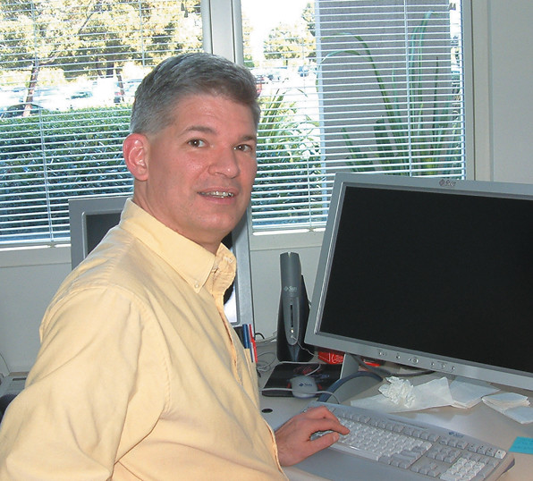
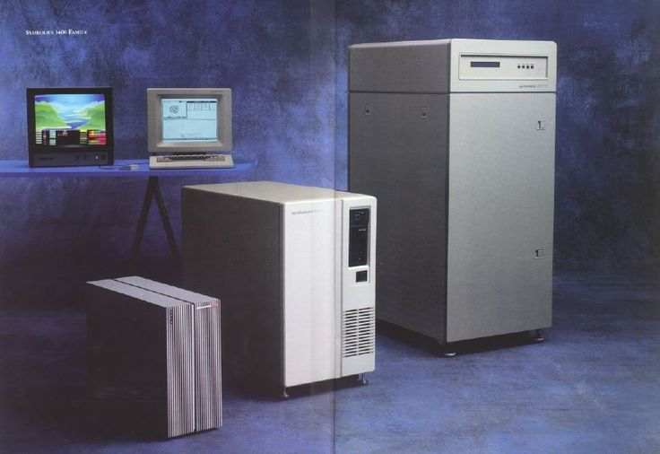
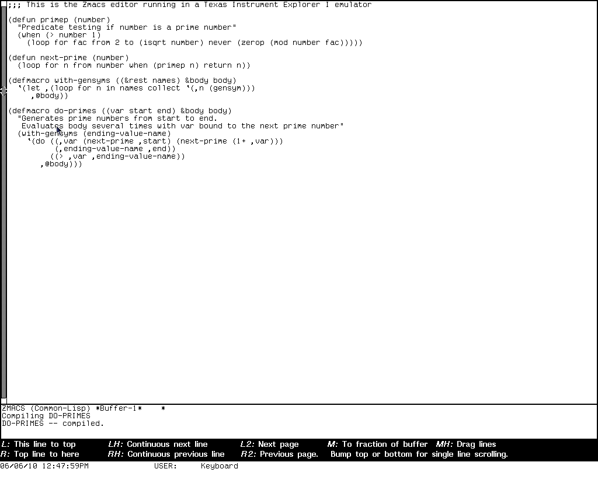

#+TITLE: Emacs
#+SUBTITLE: editor macros gone wild
#+DATE: <2022-11-21 Mon>
#+AUTHOR: Donatas Petrauskas <donatasp@wix.com>
#+OPTIONS: toc:nil num:nil
#+HTML_HEAD_EXTRA: <link rel="stylesheet" type="text/css" href="../presentation/presentation.css" />
#+HTML_HEAD_EXTRA: 

* Agenda

1. Trumpai apie ilgą istoriją.
2. 3 × Kodėl

#+begin_note
Šį pasakojimą išskaidžiau į dvi dalis. Iš pradžių susipažinsime su Emacs istorija. Tai padės suprasti šio redaktorius archaiškumus. Vėliau pabandysiu atsakyti į tris "kodėl":
1) kodėl aš naudoju Emacs,
2) kodėl kiti jį naudoja, ir
3) kodėl Emacs vis dar aktualus.
#+end_note

* Guido van Rossum

#+begin_note
Prieš pradedant kelionę laiku atgal, pradėkime nuo įdomių Guido van Rossum, Python kalbos autoriaus ir ilgamečio Emacs naudotojo, įžvalgų.
#+end_note

#+begin_export html
<video controls width="1280">
  <source src="emacs/guido-on-emacs.mp4" type="video/mp4">
</video>
#+end_export

Ištrauka iš [[https://www.youtube.com/watch?v=-DVyjdw4t9I][Guido van Rossum: Python and the Future of Programming | Lex Fridman Podcast #341]].

#+begin_note
"I actually ended up giving VS Code a very tentative try when I started out at MS and really liking it. It took me a while before I realized why that was. And I think that actually the founders of VS Code may not necessarily agree with me on this, but to me VS Code is a spiritual successor of Emacs."

Prie šių įžvalgų grįšime dar vėliau.
#+end_note

* Priešistorė

Paremta tikrais faktais

* 1962

#+begin_note
Pradėsime nuo 1962-ųjų. Tai oficialūs TECO gimimo metai. Text Editor & Corrector užima ypatingą vietą žilabarzdžių hakerių kultūroje.
#+end_note

* TECO

#+begin_quote
Real programmers don't want "what you see is what you get", they want "you asked for it, you got it".  They want editors that are terse, powerful, cryptic, and unforgiving.  In a word, Teco.
#+end_quote

* TECO

#+begin_note
TECO skirtas labai efektyviai redaguoti tekstą. Jo išskirtinumas --  programavimo galimybė. Vartotojas galėjo vykdyti savo sukurtas macrokomandas. TECO programavimo kalba buvo vaizdžiai lyginama su "triukšmu" (ang. line noise).
#+end_note

[0+0U0Q0"E1U0'Q0">Q0<<0A"R0;'D><0A"R|0;'D>>|-Q0<<-A"R0;'-D><-A"R|0;'-D>>']0

* TECO Demo

#+begin_note
  ebREADME.md ! edit with backup !

  y ! read next page !

  sTECO ! search !

  v ! see current line !

  l ! go to the next line !

  lv ! go to the next line and see it !

  -1ex ! exit without saving !
#+end_note

#+begin_note
  ! open with -scroll:5, 5 lines for commands !

  ebREADME.md

  y

  sMacros

  -s $$

  6d

  iMACROS
#+end_note

* Dan Murphy :noexport:

#+HTML: <iframe width="800" height="450" src="https://www.youtube-nocookie.com/embed/FGiMarNz96c" title="YouTube video player" frameborder="0" allow="accelerometer; autoplay; clipboard-write; encrypted-media; gyroscope; picture-in-picture" allowfullscreen></iframe>

* MIT AI laboratorija

John McCarthy kuria dirbtinį intelektą.

#+begin_note
TECO buvo naudojamas MIT dirbtinio intelekto laboratorijoje, kurioje dirbo John McCarthy, Lisp kalbos autorius.

Įdomus faktas: John McCarthy neturėjo tikslo sustoti ties pirma, skliaustelių kupina, Lisp sintakse. Bet praktikoje ji buvo labai populiari dėl meta-programavimo įgalinimo. Šiandien Lisp meta-programavimas labiausiai siejamas su *macro* funkcijomis.

Lisp, meta-programavimo ir macro tema labai persipynusi šioje istorijoje. Panašu, kad Emacs, tokiam koks yra dabar, buvo tiesiog lemta atsirasti.
#+end_note

* Richard Stallman

Sužino, kad Windows inkorporavo GNU/Linux.

#+begin_note
Kitas svarbus istorijos veikėjas yra Richard Stallman. Jis labiau žinomas kaip laisvos programinės įrangos judėjimo pradininkas ir GNU sistemos autorius.

Inspiruotas WYSIWYG redaktoriaus, su kuriuo susipažino Standfordo AI laboratorijoje, prideda naują funkcionalumą TECO: realaus laiko teksto perpiešimą ir macro sistemą, kuri leidžia vykdymo metu konfigūruoti, kas įvyks spaudžiant tam tikrą klavišą.
#+end_note

* Guy Steele

Nemoka įsijungti kompiuterio.

#+begin_note
Vienintelis švariai nusiskutęs šios istorijos veikėjas yra Guy Steele. Jis inicijavo macro komandų standartizacijos procesą, po to kai buvo pastebėta, kad bendradarbiavimas tarp komandos narių darosi komplikuotas. Prisėdus prie kito redaktoriaus, tekdavo mokytis jo konfigūracijos subtilybių. Kaip bebūtų keista, Emacs šią problemą turi iki šiol. Tai yra kultūros dalis.

Vėliau Guy Steele taps žymiu programavimo kalbų tyrėju ir autoriumi. Sukurs Scheme, ir prisidės prie C, Fortran, ECMAScript, bei Common Lisp standartizacijos.
#+end_note

* Macro standartizacija: EMACS

🄴ditor 🄼🄰🄲ro🅂

#+begin_note
EMCAS standartizacija truko 2 metus, o sėkmingas rezultatas pasklinda už MIT AI laboratorijos ribų, bet implementacijos vienaip ar kitaip yra susijusios su Lisp kalba ir egzotiškomis operacinėmis sistemomis.
#+end_note

* Lisp Machines

#+begin_note
Viena iš šių sistemų buvo Lisp mašinos -- speciali kompiuterinė įranga skirta Lisp kalbai.

Deja, devintame dešimtmetyje užėjus "dirbtinio intelekto žiemai" ir, išsekus finansavimui, bei komerciniam susidomėjimui, visos sistemos išnyks, į užmarštį nusinešdamos ir įdomias EMACS atmainas.
#+end_note

* EINE, ZWEI, SINE, Zmacs

#+begin_note
- EINE is not Emacs
- ZWEI was EINE initially
- SINE is not EINE
#+end_note

* Gosling Emacs

#+begin_note
Emacs persikelia į Unix. James Gosling, būsimas Java autorius, matydamas Emacs populiarumą sukuria Gosling Emacs.

Ši versija parašyta C kalba ir neturi Lisp kalbos plėtiniams rašyti, bet tas netrukdo jos sėkmei. Panašu, kad tuo metu EMACS vardas turėjo komercinės vertės ir žmonėms patiko WYSIWYG funkcionalumas.
#+end_note

file:emacs/gosling-emacs.jpg

#+begin_note
"The famous multi-window full-screen editor. Edit several files at once. Interprocess communication on UNIX and VMS. Extensible via macros and built-in compiled MPLISP language."
#+end_note

* James Gosling apie Emacs                                   :noexport:

#+HTML: <iframe width="800" height="450" src="https://www.youtube-nocookie.com/embed/wA7aB-oxjVc" title="YouTube video player" frameborder="0" allow="accelerometer; autoplay; clipboard-write; encrypted-media; gyroscope; picture-in-picture" allowfullscreen></iframe>

* GNU Emacs

file:emacs/richard-stallman-creates-emacs.jpg

#+begin_note
Richard Stallman nebuvo patenkintas mokamos Gosling Emacs populiarumu ir pradėjo rašyti savo versiją -- GNU Emacs (1984).

Šiuo metu, po kone 40 metų, tai yra populiariausia Emacs atmaina.

Kodėl tokio senumo sistema aktuali šiandien? Kodėl ji vis dar aktyviai vystoma?
#+end_note

* Kas yra GNU Emacs?

#+begin_note
Kad galėtume atsakyti į šiuos klausimus, noriu pasitelkti šiek tiek folkloro.

Konkurencija tarp vi ir Emacs yra tokia pat sena, kaip ir patys redaktoriai. Visi žinome apie pokštą, kad iš vi sunku išeiti. Pažiūrėkime į kelis šmaikščius Emacs apibūdinimus, turėdami omeny, kad po kiekvienu juoku, slepiasi dalis tiesos.
#+end_note

* Escape Meta Alt Control Shift

* Eight Megabytes And Constantly Swapping

EMACS Makes Any Computer Slow

Eventually Munches All Computer Storage

* Great operating system, lacking a decent editor

file:emacs/bellcurvememe.jpg

* GNU Readline

* Emacs? 2023-aisiais? 🤣

[[https://orgmode.org/][Org Mode]]

* Kodėl aš naudoju Emacs

* 1. Emacs rašymui

Vim → Emacs

* 2. Emacs kaip shell

Interaktyvus tekstas

* 3. Emacs dokumentacija

#+begin_quote
Emacs is the advanced, extensible, customizable, self-documenting
editor.
#+end_quote

* Kodėl tu norėtum išbandyti Emacs

- Lisp
- [[https://emacsforosx.com/][emacsforosx.org]]

* Fin

Klausimai?
